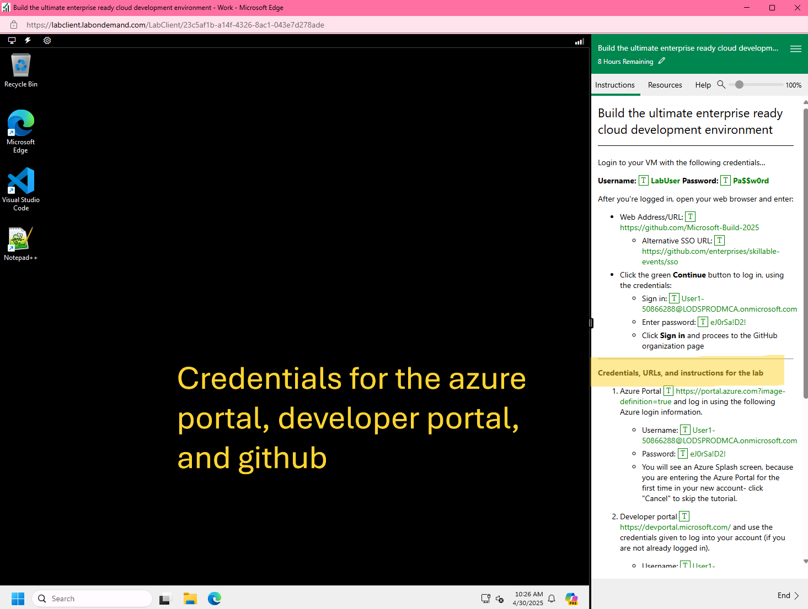
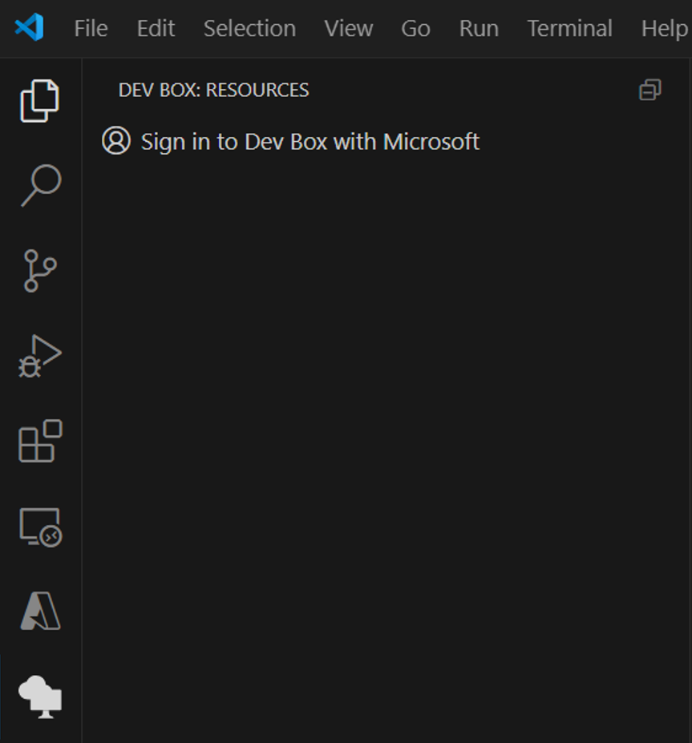
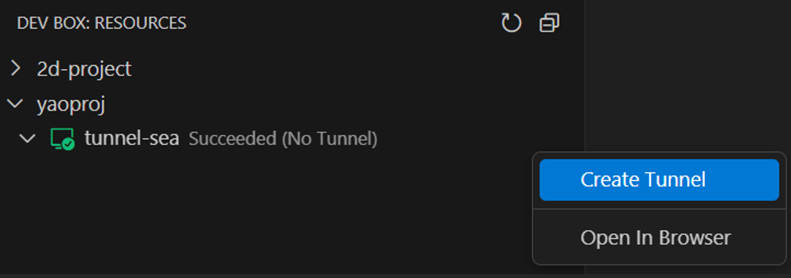
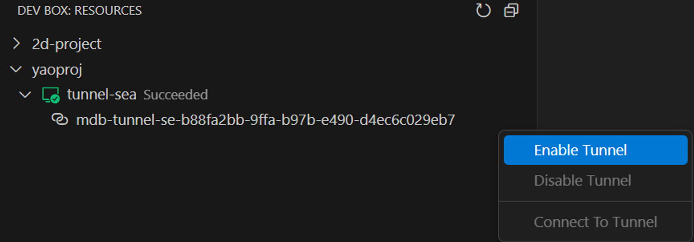
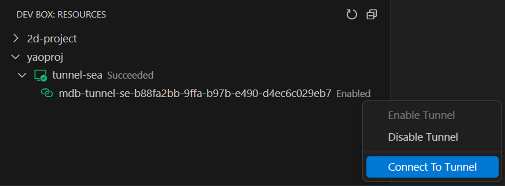
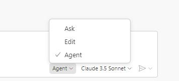
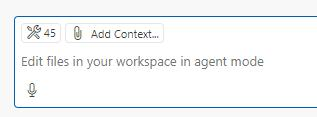
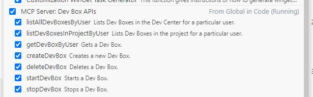
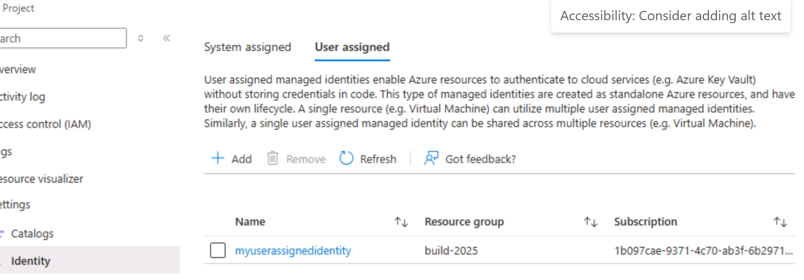

# Build the ultimate enterprise ready cloud development environment | Lab Instructions

# Part 1: Log into GitHub 

1. You will see a URL on the side panel of your machine with an SSO URL for logging into GitHub. Log into GitHub using the username and password provided.
2. **NOTE:** Microsoft will ask if you want to 'Stay signed in'. Select 'yes'.



# Part 2: Connect and use your dev box

## 1. Find your Dev Box in the Developer portal
1. Open your browser and go to [devportal.microsoft.com](https://devportal.microsoft.com). Enter your credentials - we have already given you access to the developer portal! You should find these credentials on the right side panel of your lab. 
    - Feel free to close the tutorial for the Developer Portal. 

2. You should see a Dev Box in your developer portal. If you do not see a Dev Box, click on '+New' to create one. 

3. Connect to your dev box by searching for the 'Windows App' in your Windows Search Bar. Sign in using the same credentials you used for the Developer Portal.
4. Skip the tutorial, and click on 'Connect'.
5. You have now connected to your Dev Box!

## 2. Connect to your Dev Box using a Dev Box Tunnel.

### PreRequisite ( Skip if you have already logged in once into your Dev Box)
> *Before enabling the tunnel, you MUST log into the Dev Box at least once using any client (e.g., browser, Windows App, Remote Desktop client). This step is mandatory after each shutdown and restart to establish the required user session for setting up the tunnel. Once logged in, you can disconnect from the Dev Box.*
> *You DO NOT need to log in every time you enable or connect to the tunnel — only after a shutdown or restart.*

1. Close your Dev Box session. Open VS Code on your machine. 

2. Open Extensions view in VS Code (`Ctrl+Shift+X`) and You should see the Dev Box Extension.

## 3. Sign in to the Dev Box Extension

1. Click on the profile icon on the bottom left of VS Code and click on 'Sign in to use Dev Box'. Use the same username and password you used for the Developer Portal.

2. Click the Dev Box icon in the left sidebar, and select **Sign In**.



### Create and Enable the Dev Box Tunnel


3. After signing in, you will see all the projects you have access to. Choose the project with the dev box already created for you, and select the Dev Box you want to connect to.




4. Enable the tunnel by clicking on the settings gear next to the tunnel - you'll see 'enable tunnel'. This process may take up to 1–3 minutes, as it will install VS Code on the Dev Box (if not already installed) and set up the tunnel.



### Connect to the Dev Box in VS Code

5. Once everything is set up, you can open the Dev Box in VS Code by clicking the **Connect to Tunnel** button. A new VS Code Window should pop up.

6. Install the Remote Tunnels Extension - The remote tunnels extension is required. Please click on **Install and Reload**.
   





Choose the Account that you used to start the tunnel ( Select Microsoft in this case)


Now you have connected to your Dev Box from a Dev Tunnel! 


# Part 3. Open a Developer MCP Server, enable Dark Mode for your Dev Box, and connect from your MCP

### PreRequisite

1. Disconnect your Dev tunnel. 
2. Open your terminal and type 'az login' in the command line. 
2. Login with the lab account 

3. Open the GitHub Copilot chat in your local VS Code

4. Switch Copilot to agent mode and select 'Claude 3.5' or 'Claude 3.7':

     
   *(Use the dropdown to select "Agent" mode)*

3. Validate that the Dev Box MCP is running by clicking the tool icon:

    

    

   *You should see available APIs like:*

   - `listAllDevBoxesByUser`: Lists Dev Boxes in the Dev Center for a particular user  
   - `listDevBoxesInProjectByUser`: Lists Dev Boxes in a project for a particular user  
   - `getDevBoxByUser`: Gets a Dev Box  
   - `createDevBox`: Creates a Dev Box  
   - `deleteDevBox`: Deletes a Dev Box  
   - `startDevBox`: Starts a Dev Box  
   - `stopDevBox`: Stops a Dev Box  

4. **In your chat, ask Copilot to:**  
   _“List me all of my dev boxes”_  

   - This will show you a high-level view of your Dev Boxes. 
   - It may prompt you to authorize VS Code - please do so.
   - CoPilot may ask you to run certain commands. Please click on 'Continue'.

5. **Now ask Copilot to:**  
   _“Update my [DevBoxName] to use dark mode”_

6. **Then ask Copilot to:**  
   _“Connect and launch my [DevBoxName]”_

7. **Recommended:**  
   Disconnect the browser Dev Box and reconnect with your Windows app now.

# Part 4: Explore Dev Box Snapshot and Restore
## Take a snapshot of your dev box to (later) restore

To access the self-serve + use the Snapshot and Restore feature, follow these steps:

1. Log in to the Developer Portal.
2. Select the Dev Box you wish to take a snapshot of. Click on the elipses `...`
3. Click on "Take Snapshot."
4. A dialog will appear showing the timestamp of the manual snapshot.
5. Confirm the snapshot in the dialog.
6. Your snapshot will be taken, which takes around 10 minutes. Once completed, your Dev Box can be used.


# Part 5: Customize your Dev Box

### Configure a custom image definition using AI in your Dev Box

*Create an image definition to customize dev boxes to the specific team needs and configure dev box pools to leverage the image definition when creating dev boxes*
### Connect to your Dev Box in VS Code

1. Connect to your dev box by searching for the 'Windows App' in your Windows Search Bar. Sign in using the same credentials you used for the Developer Portal. Skip the tutorial, and click on 'Connect'.
2. Open Edge browser and login to GitHub using SSO URL - https://github.com/enterprises/skillable-events/sso
3. Open Visual Studio Code in your Dev Box.
4. In the 'Setup VS Code' window, select to setup Copilot and Signin
   
   

5. Complete the signin by selecting 'Continue' on the 'Authorize Visual Studio Code' prompts
   
   
   
6. Copilot should now be setup and you can select to open VS Code

   
7. Open Copilot chat and ask to 'Show terminal' or open command prompt 'Ctrl+Shift+P' and enter '>View: Toggle Terminal'
8. In the terminal, select to download git by entering the following command 'winget install --id Git.Git -e'
9. Once git installation is complete, close and reopen VS code

10. Clone the repository by entering 'git clone https://github.com/contoso-co/eShop.git' in terminal
11. Open the cloned repository: Click on Open Folder, C Drive, Users, Click on your User, eShop) 
    
    

     
12. Go to Extensions (`Ctrl+Shift+X`) and install the Dev Box extension
    
    

    a. If already installed installed, ensure its the latest version else select to update

    


### Experience in the Dev Box VS Code Extension

1. Create a new `imagedefinition.yaml` file inside the catalog\image-definitions folder. 
2. Copy the contents from the [sample imagedefinition.yaml file](https://github.com/contoso-co/eShop/blob/main/.devcenter/catalog/image-definitions/backend/imagedefinition.yaml)  
3. For example, to configure pre-installation of VS Code and configure environment variables, add the following to the `imagedefinition.yaml` file:

    ```yaml
    - name: '~/winget'
      description: Install Visual Studio Code
      parameters:
        package: Microsoft.VisualStudioCode

    - name: '~/powershell'
      parameters:
        command: |
          $env:Path = [System.Environment]::GetEnvironmentVariable('Path','Machine') + ';' + [System.Environment]::GetEnvironmentVariable('Path','User')
    ```

4. You could continue the process to configure more packages and tools as you like!

---

### Continue editing your imagedefinition.yaml by using agentic workflows in VS Code
*To further simplify the experience of authoring the customization file, you can leverage the agentic workflow to directly generate an `imagedefinition.yaml` file through prompts and conversations.*

5. Open Copilot Chat  
    a. Select Agent mode on the bottom right of the Co-Pilot chat and choose the model Claude 3.5 Sonnet  
    b. Ensure Dev Box tools are pre-selected under Select Tools (Wrench icon bottom left of the Co-Pilot chat).
   
    


7. In the chat, enter:  
    `"I want to configure a dev box for my team with all the tools and packages required to work on the eShop repo"`  
    a. The agent will scan the repository to identify the application type and components (Web, API, Blazor, etc.)  

8. When prompted, select ‘Continue’ to configure the allowed [WinGet](#) packages and generate the `imagedefinition.yaml`  
    a. `imagedefinition.yaml` will include git cloning the specific repository onto the dev box  

9. After the initial `imagedefinition.yaml` is generated, in the chat, conversationally ask to "Change Node.js version to 18 LTS"  
10. After the `imagedefinition.yaml` is modified, select ‘Continue’ to run the Customization YAML Validator. Copy and run the validation command in the Terminal  
11.  Once validation completes, you can apply customizations on the current dev box
    
    a. Open Command Palette(Ctrl+Shift+P)  
    b. Select 'Dev Box: Apply Customization Tasks'  
    c. (You may skip and move onto next section in the interest of time) Confirm the UAC prompts to install tools and apply the settings

    

   
12. (Optional: Skip this step in the interest of time) To share and configure the team's dev boxes, save the `imagedefinition.yaml`, commit it, and push it to the repository  

---

### To save time in uploading your `imageDefinition.yaml` go to the Azure Portal and attach a catalog 
We have already pre-created an `imageDefinition.yaml` in a specific repo that you can use.

1. Go to portal.azure.com. Search for 'Dev Center' in the search bar. After clicking on your Dev Center in the Azure Portal, scroll down to click on the blue button 'Create Project' and create a front-end project for the Dev Center. Select your Dev Center. Name it ‘front-end-project’.  
2. Follow the steps to finish creating your project.  
    a. On the ‘Dev box management’ tab for the project creation flow, you can set a limit for the number of dev boxes developers can own in the project. For example, I can limit to 2 dev boxes. Please set this field to 2 or larger. After this step, click ‘Next’  
    b. On the ‘Catalogs’ tab, do not change any defaults. Click ‘Next’  
    c. On the ‘Tags’ tab, no need to select any tags. Click ‘Next’  
    d. On the ‘Review + Create’ page, Click ‘Create’  
    e. Once your project is created, click on "Go to Resource" to see your project  

3. You can create a catalog for the specific project:  
    a. Expand the 'Settings' section, select 'Identity', then 'User Assigned' tab on the blade, then ‘+Add’, and click the 'myUserAssignedIdentity' option. Then, add the identity.  
    - Note: Keep track of the first 6 characters of the subscription name once your identity has been created. This will be useful for later!

    

4. Go to the Catalog's blade above the Identity blade.Select ‘+Add’ and finish creating your project catalog by adding a name (‘MyCatalog’), selecting ‘GitHub’ as your catalog location, then select ‘Personal access token’. This will use a repository we prepared for this lab. Fill in the following:  
    - **Repository**: `https://github.com/jylama/build-2025-devcenter.git`  
    - **Branch**: `main`  
    - **Folder path**: `catalog/image-definitions`  
    - **Secret Identifier NOTE: you need to modify this URL using the first 6 characters in your subscription**: `https://keyvault-[first 6 characters of user subscription id].vault.azure.net/secrets/GitHubPAT`  This is where you can use those 6 characters you noted! You can also find the first 6 characters by going to your project, and clicking on 'overview'. 

5. Once the Catalog attach and sync are complete, click on the 'Manage' dropdown and select ‘image definitions’- you can see image definitions imported  
    a. [Optional] Choose one of the image definitions and select ‘Build’ - this action will generate a custom image to be used when creating dev boxes, thereby enhancing dev box creation times and achieving cost savings. This will take some time, so please move onto part 4 as it loads. 


# Part 6: Go to the Azure Portal and add additional governance to your dev box setup

*We are going to edit your existing project and create a new pool to use the custom definition you previously created along with the custom network. We will add additional governance capabilities to that project + pool setup for utmost security and easiest management.*

### *Create a custom network connection in the Azure Portal*
*Create custom network connection resources to leverage firewalls or connect to on-premise resources.  
For the sake of time, we have created a VNET.*

1. Open up a new tab and go to portal.azure.com, log in using your user name and password for the Azure Portal (found in the side panel) and follow the steps to finish creating a Network Connection

    a. Search for ‘Network Connections’ in the search bar of the Azure portal. Click ‘Create’ to start network connection creation.  
    b. Name your network connection. Select the Virtual Network we have provided in our new region Spain Central. Click on ‘Create’.

### *Attach your network connection to your Dev Center* 
Attach your network connection to your Dev Center so it can later be used to create Dev Boxes. 
1. Look up 'Dev Center' in the search bar. Select your Dev Center. 
2. Click on the 'Dev Box Configuration' dropdown, then select 'Networking' 
3. Click on 'Add'. Then select the network connection you created. 

## Configure your existing project for additional governance

1. Navigate to your existing project you created in the customizations section. Select ‘Settings’ in the side menu.

### Apply Dev Box limits to control the amount of Dev Boxes that can be created per project as a cost control.

2. Select the check box to ‘Apply limits’. Set the limit field to 2 or larger.
3. Click on ‘Apply’ to apply all of these project edits.

### Create a dev box pool to use your image definition

4. Navigate to the Manage section in the side menu. Select the 'Dev Box pools' item. Then you can create a Dev Box Pool by clicking "Create".
5. Select a name, and in the dropdown you'll seeimage definitions - pick 'frontend-eng'.  
   Select 32 vCPU compute, and 2048 GB SSD for storage for the SKU. Later, when dev boxes are created in this pool, they'll be created based on the imageDefinition.yaml, which provides the base image and a set of customizations to apply.
6. Leverage the custom network for your pool (if your network connection hasn’t finished loading, use the Microsoft Hosted Network and select the region that is best for you based on your current location for optimal latency). Leave all other options to their defaults.  
   At the very end, click on the check-box for licensing.

### Enable SSO

8. From your project, click on the ‘Manage’ dropdown and then ‘Dev Box Pools’
9. Scroll right, click on the elipses, you'll see a pencil icon to edit. 
10. Click on the ‘Enable Single Sign On’ checkbox. 

# Part 7: Manage your dev box in scale
*Manage your dev boxes in scale by applying project policies.*

### Create a default Project Policy

1. Go to your Dev Center, click on ‘Manage’ in the lefthand navigation, then click on ‘Project Policy’ in the dropdown menu. Click on ‘Create’ to begin creating a project policy.

*We will work on creating a default policy. This will configure the settings any current and future projects will use as a default. We are going to create a policy that enables the 8vCPU SKUs by default.*

Follow these steps to create a project policy:

2. Click on ‘Create a policy’
3. Click on ‘Select SKUs’ and then select ‘A specific SKU or group of SKUs. Select all the 8vCPU SKUs.
4. Click on ‘Select Images’ and then select ‘All current and future images’
5. Click on ‘Select Networks’ and then select ‘All current and future networks’
6. Click on ‘Create’ to finish


# Part 8: Give yourself project access 
*Admins normally provide Dev Box user access to developers. Today, we will give ourselves access!*

1. Go to the project you recently created and navigate to the 'Access Control (IAM)' blade.
2. Click on '+Add', and add a role assignment.
3. Search for the 'DevCenter Dev Box User' role. On the next page, pick '+Select members'.  
   Add your username which is the same as what you used for logging into the Azure Portal, hit 'Select', then click on 'Review + assign' twice.

# Part 9: Testing out dev box in the future - what should you do? 
1.	Search for ‘Microsoft Dev Box’ in the azure portal to navigate to the Dev Box service. 
2.	Click on ‘get started’. This will navigate you to a wizard to set up your dev box resources. Fill out the fields in the template to deploy all of the necessary Azure resources for dev box. 
    - Resource group: build 2025
    - Your region should be pre-selected from the resource group
    - DevCenter Name, Project Name, Pool Name: **NOTE** make sure you are using unique names for each of your resources
3. Click on 'Next' and wait to ensure there aren't any errors related to duplicates in the resource names.
4. Click on 'Create' to spin up resources. 
5.	Once the resources are deployed, go to devportal.microsoft.com or refresh your existing instance. From here click on ‘New Dev Box’ and follow the steps for Dev Box creation.  


# BONUS: Monitoring your dev box with Azure Monitor
1. Look up ‘Dev Centers’ in the Azure Portal 
2. Click on the build devcenter
3. Click on ‘Monitoring' and select 'Logs' in the side menu.  
4. Close the pop-out window. 
5. Click on 'Run' for any of the sample queries. We won't use any of those today. 
5. Select 'KQL Mode' on the right dropdown. Delete the previous query, and paste the following query: 

``` 
// Summarize the health check results for all the DevBoxes deployed in your DevCenter

let HealthCheckIdToDescription = (idx:long) {
    case(
        idx == 0,  "DomainJoin",
        idx == 1,  "DomainTrust",
        idx == 2,  "FSLogix",
        idx == 3,  "SxSStack",
        idx == 4,  "URLCheck",
        idx == 5,  "GenevaAgent",
        idx == 6,  "DomainReachable",
        idx == 7,  "WebRTCRedirector",
        idx == 8,  "SxSStackEncryption",
        idx == 9,  "IMDSReachable",
        idx == 10, "MSIXPackageStaging",
        strcat("InvalidNameIndex: ", idx)
     )
};
let GetHealthCheckResult = (idx:long) {
    case(
        idx == 0, "Unknown",
        idx == 1, "Succeeded",
        idx == 2, "Failed",
        idx == 3, "SessionHostShutdown",
        strcat("InvalidResultIndex: ", idx)
    )
};
DevCenterAgentHealthLogs
| where TimeGenerated > ago(1d)
//| project-reorder TimeGenerated, OperationName, DevBoxName, SessionHostName, NicResourceId, SubnetResourceId, _ResourceId, Status, SessionHostHealthCheckResult, UpgradeState, LastHeartBeat
| where isnotempty(SessionHostHealthCheckResult)
| mv-expand todynamic(SessionHostHealthCheckResult)
| evaluate bag_unpack(SessionHostHealthCheckResult)
| evaluate bag_unpack(AdditionalFailureDetails)
| extend HealthCheckDesc = HealthCheckIdToDescription(HealthCheckName)
| extend HealthCheckResult=GetHealthCheckResult(HealthCheckResult)
| summarize count() by HealthCheckDesc, HealthCheckResult

 ``` 

6. Click on ‘Run’ to run your query.  

# BONUS: Restore your dev box in the Developer Portal!
*We can now complete step 8 in part 2 to restore your Dev Box!* 
1. Go to devportal.microsoft.com
2. Select the Dev Box environment you wish to restore.
3. Click on "Restore."
4. Choose the desired [restore](#) point from the list of available **snapshots**.
5. Confirm the restoration process.
6. Once the restoration is complete, you will receive an email notification informing you that your Dev Box is restored and ready to use.


😀 Congratulations! You have finished the lab! 😀
